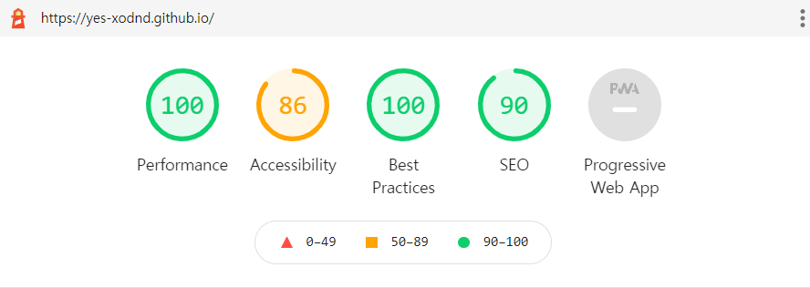
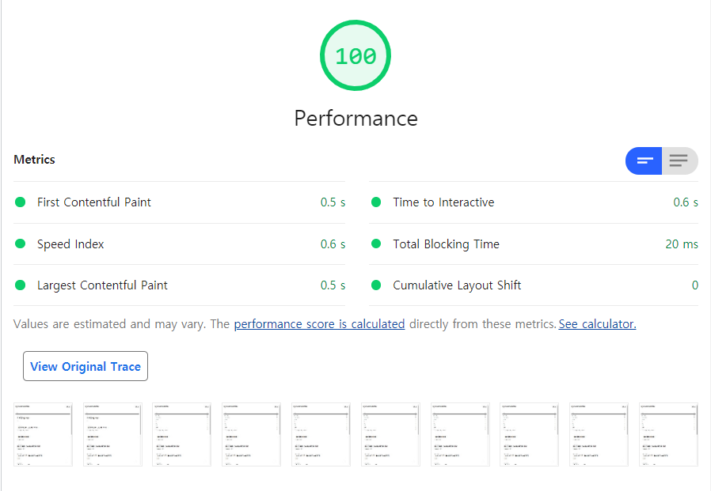
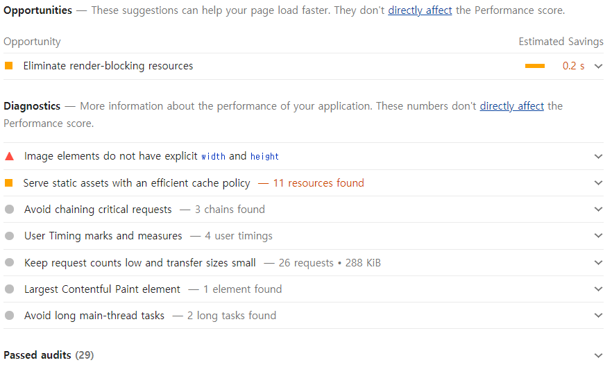

# 웹 성능 측정 도구: Chrome Lighthouse

프론트엔드 성능 최적화에 대해 찾아보다가, 크롬 브라우저에 Lighthouse라는 퍼포먼스 측정 도구가 포함되어 있는 것을 알게 되었습니다. 구글이 직접 관리하는 [오픈소스 프로젝트](https://github.com/GoogleChrome/lighthouse)로, 웹 사이트의 성능부터 SEO까지 측정해 보고서를 생성해주는 기능을 가지고 있습니다.

## 사용 방법

아래의 방법 중 한 가지를 선택해 사용할 수 있습니다. 

크롬 개발자 도구와 web.dev의 측정 결과가 다를 수 있는데, web.dev 쪽이 더 최신 버전이라고 합니다. [참고](https://github.com/GoogleChrome/web.dev/issues/442). web.dev에서는 구글 계정으로 로그인하여 개선 과정을 tracking 할 수 있습니다.

- 크롬 개발자도구 - Lighthouse
- [web.dev](https://web.dev/measure/)의 측정 페이지에서 분석을 원하는 사이트의 URL을 입력
- [크롬 웹 스토어](https://chrome.google.com/webstore/detail/lighthouse/blipmdconlkpinefehnmjammfjpmpbjk?hl=ko)에서 확장 프로그램 설치 후 사용
- npm 패키지 설치 후 [커맨드 라인](https://developers.google.com/web/tools/lighthouse/#cli) 또는 [Node 모듈로 사용](https://github.com/GoogleChrome/lighthouse/blob/master/docs/readme.md#using-programmatically)

## 테스트

기술 블로그의 성능을 측정하기 위해, 크롬 개발자 도구를 통해서 Lighthouse 보고서를 생성해보았습니다. 

먼저 다섯 개의 항목에 대한 점수가 나오고, 각 항목마다 측정 기준별 점수와 개선점, 분석 결과 등을 보여줍니다. 퍼포먼스에서는 구글이 웹 페이지 성능 측정을 위해 만든 [기준](https://web.dev/lighthouse-performance/#metrics)별 측정 결과를 보여주고 있습니다.

`Opportunity`는 성능에 영향을 줄 수 있는 개선 요소를 의미하고, `Diagnostic`은 웹 페이지의 성능과 관련되어 있지만,성능에 바로 영향을 주지는 않을 요소들입니다. 

각 항목을 누르면 문제 요소에 대한 자세한 정보, 개선방법 또는 개선 도구 등의 정보를 제공합니다. 또한 링크를 통해 web.dev의 자세한 안내 게시물을 참고할 수 있습니다.

> 예시 : [Eliminate render-blocking resources](https://web.dev/render-blocking-resources/)

## 정리

프론트엔드에서의 성능에 대해 신경쓰지 못하고 있었는데, 명확한 기준으로 성능을 측정하고 개선 방안을 제시해주는 도구를 알게 되었습니다. [LINE](https://engineering.linecorp.com/ko/blog/line-securities-frontend-4/)과 같은 기업에서도 이를 활용하고 있는 것으로 보이므로, 개발과 성능 개선을 위해 활용해보면 좋을 것 같습니다. 먼저 기술 블로그의 접근성과 SEO 개선부터 시작해봐야겠습니다.

## 참고 자료

>- [Google Developers - Lighthouse](https://developers.google.com/web/tools/lighthouse/)