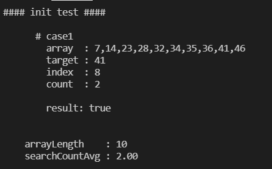
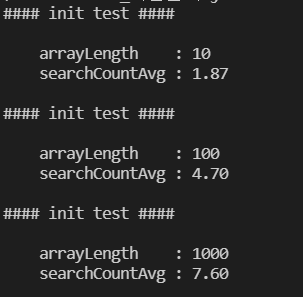

# 이진 탐색 BinarySearch

이진 탐색 알고리즘은 오름차순 정렬된 배열에서 특정한 값의 위치를 찾는 알고리즘입니다. 기본적인 선형 탐색에 비해 시간 복잡도가 낮아, 탐색에 많이 사용되는 알고리즘입니다.

``` js
// arr 오름차순 정렬된 배열
// target 배열에서 찾고자 하는 값
const targetIndex = binarySearch(arr, target);
```

배열의 가운데 요소부터 탐색하며 `target`과의 대소비교를 통해 가운데 요소를 기준으로 나누어진 배열의 한 쪽을 탐색하기 때문에, 계속 탐색 범위가 반으로 줄어들게 됩니다. 따라서 N개의 요소를 가진 배열에 대해 O(logN)의 시간복잡도를 가지게 됩니다.


## 자바스크립트 구현

``` js
/**
 * 오름차순 정렬된 배열에서 원하는 값의 인덱스를 반환합니다.
 * 배열에 값이 존재하지 않을 경우 -1을 반환합니다.
 * 자료의 개수 N에 대해 O(logN)의 시간복잡도를 갖습니다.
 *  
 * @param {*[]} arr 오름차순 정렬된 배열
 * @param {*} target 찾고자 하는 값
 * 
 * @returns {number} target의 인덱스, 없을 경우 -1
 */
function binarySearch(arr, target) {
  // 배열의 처음과 마지막 인덱스를 각각 low와 high에 할당합니다.
  let low = 0;
  let high = arr.length - 1;
 
  // 찾는 값이 없을 경우, low > high가 되어 무한 루프에 빠지므로
  // 종료조건을 아래와 같이 설정합니다.
  // low == high일 때 low = high = targetIndex
  while (low <= high) {
    const mid = Math.floor((low + high) / 2);
    const item = arr[mid];
    
    if (target === item) {
      return mid;
    }

    if (target < item) {
      high = mid - 1;

    } else {
      low = mid + 1;
    }
  }

  return -1;
}
```


## 테스트

다음과 같이 테스트 함수를 만들어 성능과 결과를 테스트해보았습니다. 시행 횟수와 배열 길이를 입력해 그 테스트 결과를 확인할 수 있으며, 평균 탐색 횟수를 출력합니다.

``` js
/**
 * binarySearch 함수를 테스트합니다.
 * 
 * @param {number} count 시행횟수
 * @param {number} arrLength 배열의 길이
 * @param {boolean} logCaseResult 각 케이스 결과 출력 여부
 */
function test(count = 10, arrLength = 10, logCaseResult = true) {
  console.log('#### init test ####');
  let searchCountTotal = 0;

  for (let i = 0; i < count; i++) {
    const arr = createRandIntArray(arrLength);
    const target = getRandomItem(arr);
    const { index, searchCount } =  binarySearchForTest(arr, target);
    searchCountTotal += searchCount;
    
    if (logCaseResult) {
      console.log(`
      # case${i + 1}
        array  : ${arr}
        target : ${target}
        index  : ${index}
        count  : ${searchCount}

        result: ${arr.findIndex(item => item === target) === index}
      `);
    }
  }

  console.log(`
    arrayLength    : ${arrLength}
    searchCountAvg : ${(searchCountTotal / count).toFixed(2) }
  `);
}
```

길이 10의 배열에 대해 한 번 시행하면 다음과 같은 결과를 확인할 수 있습니다.



`Array.findIndex` 메서드와 `binarySearch`의 결과를 비교해, 정확한 인덱스를 찾는 것을 확인할 수 있습니다. 

탐색 횟수를 확인하기 위해, 시행 횟수와 배열 길이를 늘려보았습니다. 각각 30번씩 시행하였습니다.

``` js
test(30, 10, false);
test(30, 100, false);
test(30, 1000, false);
```



실제로는 각각 logN보다 적은 횟수를 탐색하는 것을 확인할 수 있습니다. 