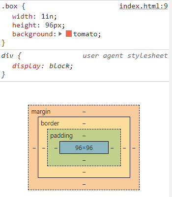
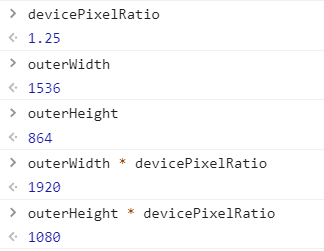
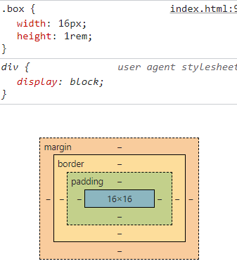

# CSS 길이 단위

CSS의 프로퍼티에는 해당 프로퍼티에 설정 가능한 값들이 있습니다. 예를 들어, [MDN](https://developer.mozilla.org/ko/docs/Web/CSS/width#값)에서 `width`를 찾아보면, `<length>`, `<percentage>`, `auto` 등 설정 가능한 속성값을 명시하고 있습니다. 꺽쇠와 함께 표현된 `<length>`와 같은 값을 CSS값이라고 합니다.

가장 대표적이고, 가장 자주 사용하는 CSS값인 `<length>`에 대해서 공부하고 정리해보았습니다.

## 절대 길이 단위

일반적으로 항상 동일한 크기로 간주되는 단위들입니다. `px`을 제외하면 화면 출력보다는 인쇄에 주로 사용합니다.

- `in` : 인치
- `px` : 픽셀, 1in / 96
- `cm` : 센티미터
- `pt` : 포인트, 1in / 72

### px 픽셀

px는 절대 길이 단위로, 모든 길이 단위의 기준이 되는 단위(canonical unit)입니다. 

``` css
.box {
  width: 1in;
  height: 96px;
}
```

이 박스의 크기를 개발자 도구로 확인해보면, 너비와 높이 모두 96px로 계산된 것을 확인할 수 있습니다.




이 때의 픽셀(논리 픽셀)은 모니터의 해상도를 나타낼 때 사용하는 픽셀(물리 픽셀)과는 다른 의미를 가집니다. 논리 픽셀과 물리 픽셀의 비율은 자바스크립트에서 `window.devicePixelRatio`를 통해 확인할 수 있습니다. 브라우저 크기를 최대로 한 상태에서 `outerWidth`, `outerHeight`와 `devicePixelRatio`를 이용해 계산하면 실제 해상도인 1920과 1080을 얻을 수 있습니다. 또한 `1.25cm`를 화면에 출력하면, 물리적으로 1cm 길이를 갖는 것을 확인할 수 있습니다.




## 상대 길이 단위

다른 길이에 대해 상대적인 길이를 나타냅니다. 반응형 웹 디자인을 할 때 많이 사용됩니다.
주로 사용하는 단위는 다음과 같습니다.

- `em` : 부모 요소의 글꼴 크기
- `rem` : 루트 요소의 글꼴 크기, 일반적으로 `<html>`
- `vw` : 뷰포트 너비의 1%
- `vh` : 뷰포트 높이의 1%

### rem

`rem`은 루트 요소의 글꼴 크기에 비례한 크기를 나타냅니다. 일반적으로 루트 요소인 `<html>`의 `font-size`는 `16px`로 설정되어 있으므로, 해당 프로퍼티를 변경하지 않고 `1rem`을 사용하면 `16px`과 동일한 크기로 표시됩니다.

``` css
.box {
  width: 16px;
  height: 1rem;
}
```



`rem` 같은 경우는 브레이크포인트마다 루트 요소의 글꼴 크기만 변화시켜주면 그에 맞춰서 하위 요소들의 크기를 조정할 수 있으므로, `font-size`, `margin`, `padding` 등에 사용하여 반응형 웹을 편리하게 구현할 수 있습니다.

``` css
/* 스크린 크기가 1024px보다 커지면 루트 요소의 font-size를 150%로 변경 */
@media (min-width: 1024px) {
  :root { font-size: 150%; }
}
```

또한 브라우저 글꼴 크기 설정을 변경했을 때, 이에 대응하여 글자와 레이아웃의 크기를 조정할 수 있으므로 저시력자의 접근성 향상에도 도움이 됩니다.

다만 `rem` 계산이 다른 브라우저들이 있기 때문에, `rem`을 통해서 CSS를 작성했을 때는 여러 브라우저에서 호환성 테스트를 거치는 것이 좋겠습니다.


## 참고 자료

> - [CSS값과 단위](https://developer.mozilla.org/ko/docs/Learn/CSS/Building_blocks/Values_and_units)
> - [W3C CSS Draft](https://drafts.csswg.org/css-values/#absolute-lengths)
> - [MDN - devicePixelRatio](https://developer.mozilla.org/ko/docs/Web/API/Window/devicePixelRatio)
> - [김정태님 블로그 - CSS에서 rem 단위 사용하기](https://blog.jeongtae.com/rem-%EA%B3%A0%EC%B0%B0)