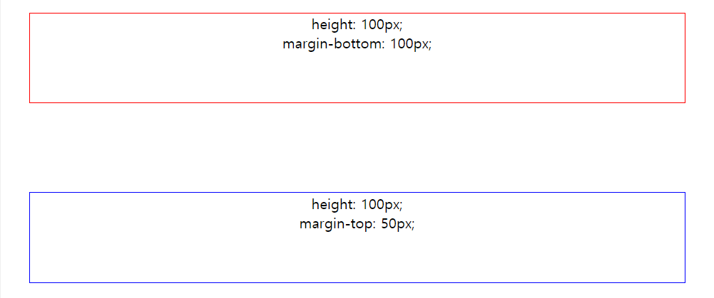
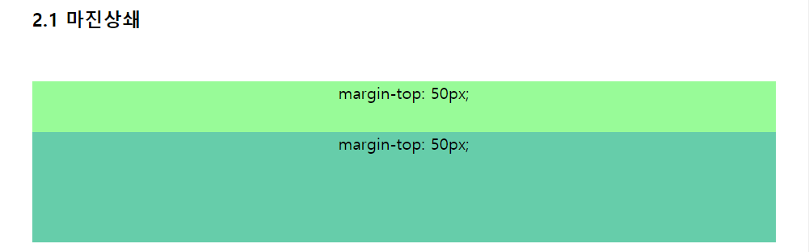
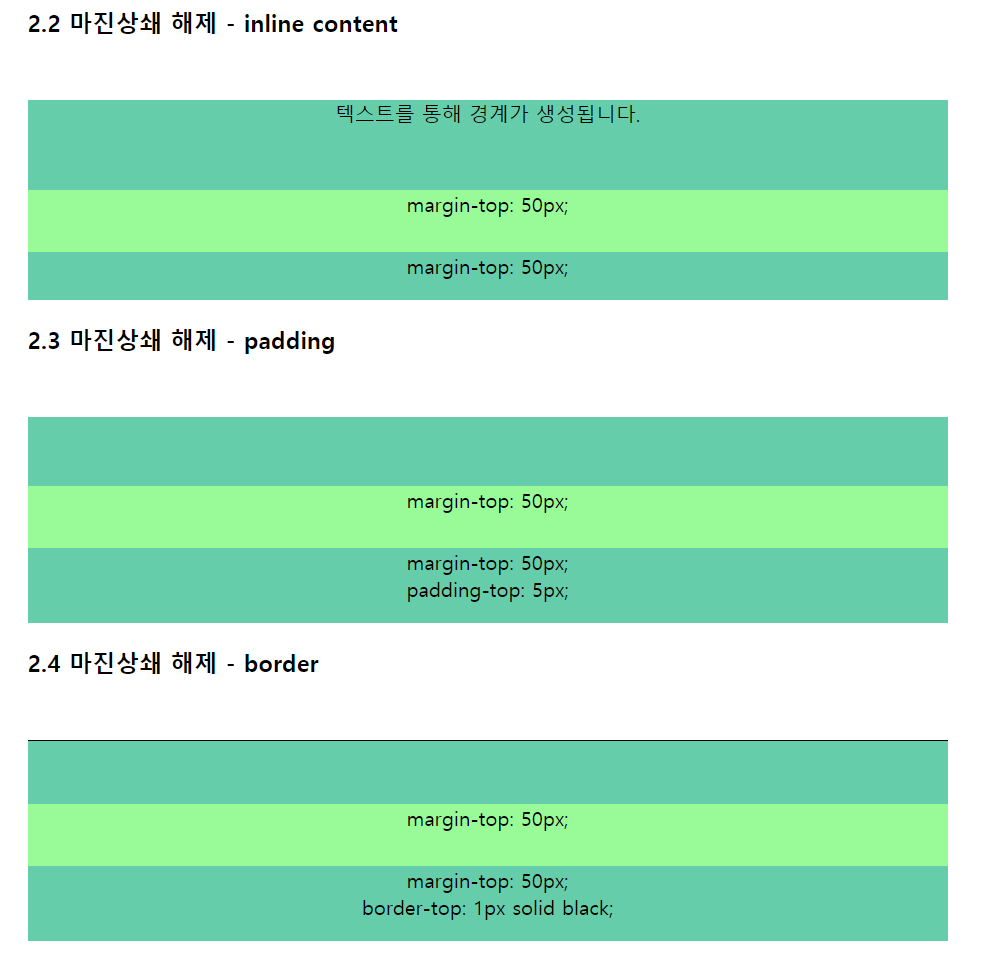
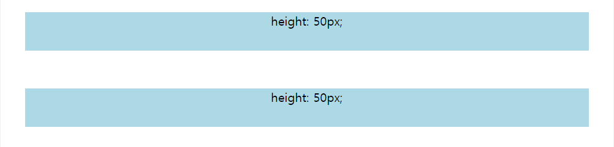

# CSS 마진 상쇄 (Margin Collapsing)

블록 요소의 상하 마진이 겹칠 때, 가장 큰 크기의 마진으로 합쳐지는 현상을 마진 상쇄(Margin Collapsing)이라고 합니다. 같은 스타일의 블록 요소를 여러 개 연속으로 표시할 때, 블록 목록의 처음/마지막과 블록 사이의 간격을 동일하게 만들어주기 위한 규칙이라고 볼 수 있을 것 같습니다. 

## 마진 상쇄가 발생하는 기본 상황

### 1. 인접 형제

인접 형제 요소의 마진이 겹칠 때 마진 상쇄가 발생합니다. 가장 기본적인 마진 상쇄입니다.

### 2. 부모 요소와 자식 요소간 경계가 없을 때

부모 요소와 자식 요소 사이의 상단 또는 하단에서, 두 요소의 마진이 경계 없이 만나게 되면 마진 상쇄가 발생합니다. 

이것을 방지할 수 있는 경계는  `border`, `padding` 또는 인라인 컨텐츠입니다. 각 경계를 통해 마진상쇄가 풀리는 예시입니다.

### 3. 빈 요소

높이가 0인 요소는, 자신의 위아래 마진이 만나 마진 상쇄가 발생합니다. 빈 요소란 `border` / `padding` / `height` / `min-height` / `max-height` 속성이 없고 인라인 콘텐츠가 없는 요소입니다.

`height: 50px`인 두 요소 사이에 `padding-top: 50px; padding-bottom: 50px;` 인 요소를 위치시키면, 위아래 마진이 만나 50px로 표현됩니다.

## 정리

마진 상쇄는 편리한 부분도 있지만, 코드의 의도와 다르게 작동하는 것처럼 보일 수 있기 때문에 이를 염두에 두고 CSS 코드를 작성해야겠습니다.

## 참고 자료

>- [MDN - 여백 상쇄 정복](https://developer.mozilla.org/ko/docs/Web/CSS/CSS_Box_Model/Mastering_margin_collapsing)